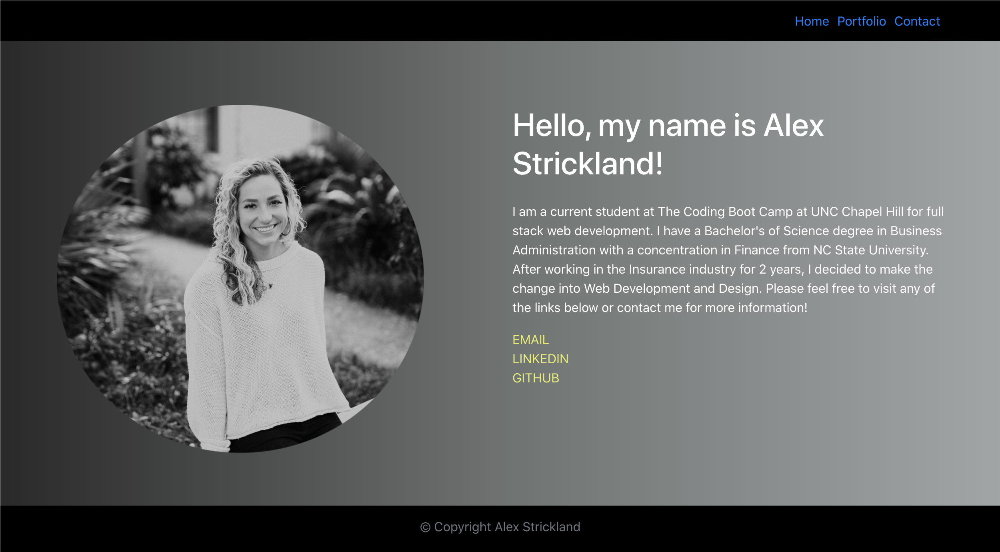

# react-portfolio

  [](https://opensource.org/licenses/ISC)

  ## Description
  For this project, I have created a portfolio of my personal projects using react. This portfolio contains an about me page, portfolio page, and a contact page. The portfolio page has pinned projects from my personal portfolio.

  ## Table of Contents

  * [Description](#Description)
  * [Installation](#Installation)
  * [Usage](#Usage)
  * [License](#License)
  * [Questions](#Questions)

  ## Installation

  To install necessary dependencies, please run the following command:
  ```
  npm install
  ```

  ## Usage
  Click on the tabs at the top right of the page to navigate to each separate page on my website!

  
  
  [Deployed Application](https://alexhstrickland.github.io/)

  ## License
  This project is covered under the ISC license. Visit the following link for more information on this license: [ISC](https://opensource.org/licenses/ISC)

  ## Questions
  For any questions about the project, please contact me by either of the following links:
  
  * Email - alexhstrickland@gmail.com 
  
  or visit my GithHub profile
  
  * GitHub - [alexhstrickland](https://github.com/alexhstrickland)

